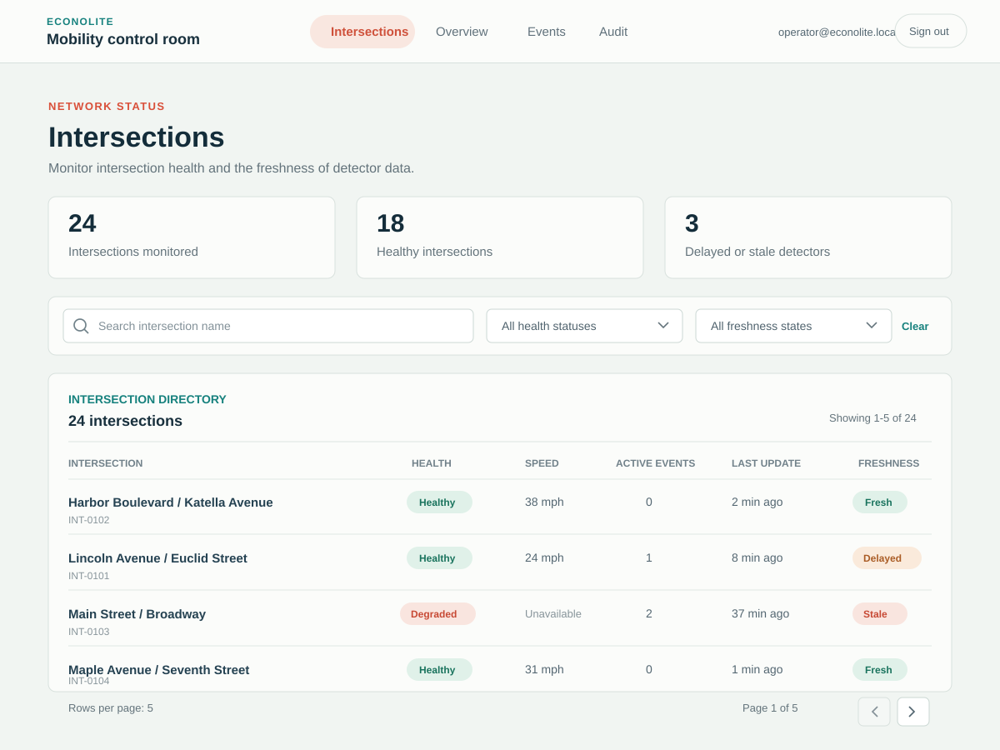
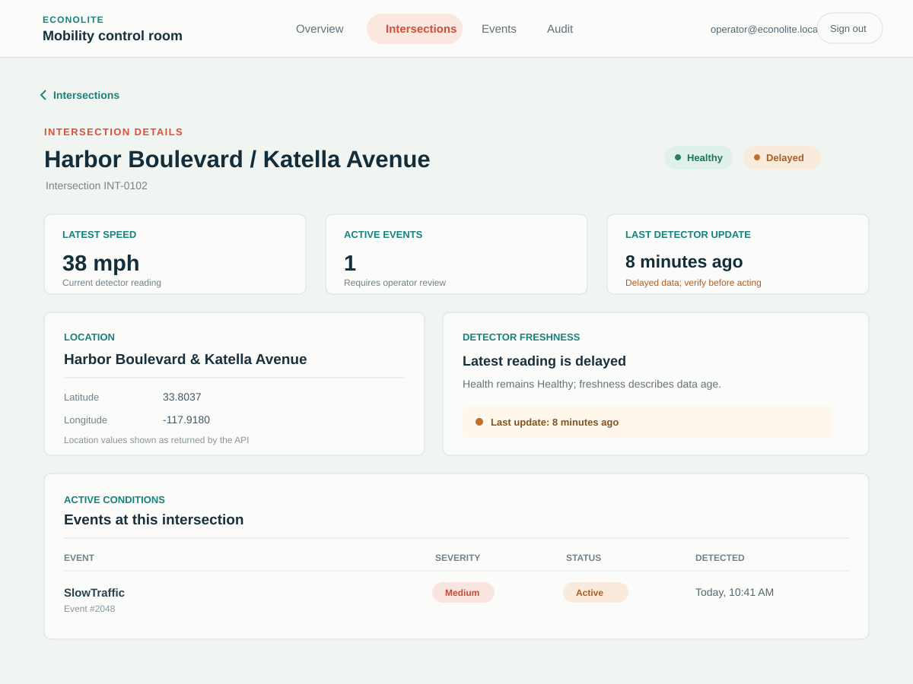

# Feature 5: Intersection Monitoring Dashboard

## Goal

Give an operator a reliable view of intersection health and detector freshness, with ways to find an intersection and inspect its current details.

This feature builds on the existing intersection API and dashboard data loading. Keep the API as the source of truth. Do not infer that an intersection is healthy merely because its data loaded successfully, or infer that it is unhealthy solely because its detector data is stale.

## Domain Rules

1. **Intersection health and detector freshness are separate concepts.**
   - Health describes the intersection's operational status according to the existing domain/API contract.
   - Freshness describes how recently the detector last reported data.
   - The UI must display both without treating one as a substitute for the other.

2. **Freshness is evaluated against the last detector update time.**
   - Use the API-provided last detector update timestamp.
   - Compare it with the current time and the configured freshness thresholds.
   - The thresholds must come from one documented configuration or domain rule, not duplicated frontend and backend constants.
   - If no last detector update exists, represent freshness as unknown or stale according to the agreed API contract. Do not label missing data as fresh.
   - If the timestamp is invalid or cannot be interpreted, do not present the data as fresh.

3. **Active-event summary includes only events considered active by the existing traffic-event lifecycle.**
   - Reuse the established event status definition; do not create a second definition of “active” for this feature.
   - An intersection with no active events should show a count of zero, not a missing or misleading value.

4. **List filtering and pagination are applied by the API.**
   - The API returns the page of results and the total count needed by the client.
   - Filtering must happen before pagination so page counts and results are consistent.
   - Results need deterministic ordering so that moving between pages does not unpredictably reorder equal-valued rows.

5. **Unavailable or failed data must not be shown as a healthy empty result.**
   - A failed request is an error state, not an empty intersection list.
   - The UI must preserve the distinction between “no matching intersections” and “could not load intersections.”

## User Stories

### Story 1: View the intersection summary

**As an operator,** I want to see a summary of intersections and their current operational information, **so that** I can quickly identify where attention may be needed.

**The list item or table row must show:**
- Intersection name and stable identifier.
- Health/status using the existing API/domain status values.
- The latest speed value when available.
- The number of active traffic events.
- The last detector update time.
- Detector freshness: fresh, delayed, or stale.

**Acceptance criteria:**
- The dashboard loads intersection data from the API; it does not use hard-coded production rows.
- Health/status and freshness are both visible and are not represented as the same field.
- If speed is unavailable, the UI shows an explicit unavailable value rather than zero.
- If there are no active events, the count is shown as zero.
- The update time is displayed in a human-readable format and remains unambiguous about its time zone.
- The freshness label is derived from the configured freshness rule and the last detector update time.
- The view distinguishes loading, successful results, no results, and request failure.
- When the request fails, the UI does not present an empty table as though there are no intersections.

### Story 2: Filter intersections by name

**As an operator,** I want to search intersections by name, **so that** I can quickly locate a specific intersection.

**Acceptance criteria:**
- The operator can enter a name or partial name as a filter.
- Matching behavior is consistent and documented. Prefer case-insensitive partial matching unless the existing API contract specifies otherwise.
- Clearing the name filter restores the unfiltered results.
- Changing the filter resets pagination to the first page.
- The filter is sent to the API; filtering a single loaded page in the browser must not produce incomplete results.
- A successful search with no matches shows a “no matching intersections” state, distinct from an API error.

### Story 3: Filter intersections by health status

**As an operator,** I want to filter intersections by health status, **so that** I can focus on intersections in a particular operational state.

**Acceptance criteria:**
- The available filter values come from the established status contract; the UI does not introduce new health statuses.
- The operator can select a status and clear the selection.
- The selected status is applied by the API before pagination.
- Changing the health filter resets pagination to the first page.
- The selected filter is visibly represented in the control.
- An empty result for a valid filter is shown as no matching intersections, not as an error.

### Story 4: Navigate paginated intersection results

**As an operator,** I want to move through large intersection result sets, **so that** the dashboard remains usable as the system grows.

**Acceptance criteria:**
- The API accepts the agreed page and page-size parameters and returns the result items and total result count.
- The client provides previous/next navigation and indicates the current page and total pages or total results.
- Previous is unavailable on the first page; next is unavailable on the final page.
- Page size is bounded by a documented server-side maximum.
- Changing filters resets to the first page.
- An out-of-range page is handled consistently by the API and client; it must not be mistaken for a successful empty search.
- Sorting is deterministic, including when multiple intersections have the same primary sort value.

### Story 5: Inspect an intersection's details

**As an operator,** I want to open an intersection detail view, **so that** I can examine its location, detector status, and active-event summary.

**The detail view must show:**
- Intersection name and stable identifier.
- Location information returned by the API.
- Current health/status.
- Latest speed when available.
- Last detector update time and freshness.
- Active-event count and the active-event summary available from the API.

**Acceptance criteria:**
- The detail view loads the selected intersection by stable identifier from the API.
- The displayed intersection identity matches the selected row.
- Missing optional values are displayed as unavailable; they are not fabricated.
- A not-found response displays a specific not-found state.
- A request failure displays an error state with the application's standard error details and retry behavior.
- Loading the detail view does not change or overwrite the selected intersection's identity while the request is pending.
- The detail view distinguishes stale detector data from an intersection health status.

### Story 6: Understand stale or delayed detector data

**As an operator,** I want stale or delayed detector data to be clearly identified, **so that** I do not mistake old readings for current traffic conditions.

**Acceptance criteria:**
- The freshness classification follows the shared threshold rule.
- A reading classified as delayed or stale is visibly different from a fresh reading and includes the last update time.
- Missing detector timestamps are never shown as fresh.
- Stale or delayed data does not silently change the intersection's health status.
- If the API is responsible for computing freshness, it returns the classification and the client displays it. If the client computes freshness, the threshold is supplied through a shared, documented contract. Do not independently implement conflicting rules in both layers.
- Boundary behavior at each configured freshness threshold is covered by tests.

### Story 7: Retry after an intersection request fails

**As an operator,** I want to retry a failed intersection request, **so that** I can recover without leaving the dashboard.

**Acceptance criteria:**
- The list and detail views provide retry behavior consistent with the existing shared error patterns.
- Retrying returns the view to a loading state.
- A failed retry continues to show an error, not an empty successful result.
- A successful retry displays the latest API response.
- Existing valid data is not replaced with fabricated empty data while a refresh is pending or fails, if the current application pattern supports retaining prior data.

## Screen Design

Follow the visual language of the existing Mobility Control Room overview shown in the reference screenshot. These screens belong inside the existing application shell; do not create a separate visual identity for intersections.

### Shared visual direction

- Keep the existing top navigation, product identity, signed-in operator, and sign-out action. The Intersections navigation item is selected while on either intersection screen.
- Use the screenshot's calm, light control-room palette: a soft near-white page background, white or near-white content surfaces, dark ink for primary text, muted gray for supporting text, teal for section labels, coral/red for attention states, and green for healthy states.
- Use color semantically and consistently. Always pair status colors with readable text labels so color is not the only signal.
- Match the screenshot's compact, restrained typography and generous whitespace. Use a clear page title, a short supporting sentence, and smaller section headings; avoid oversized hero content.
- Use thin neutral borders and the existing subtle surface treatment for distinct data regions. Keep corner radii modest and consistent with the reference; do not add decorative gradients, illustrations, or nested card containers.
- Align content to the existing app shell's page gutters and responsive width. Maintain clear row dividers and column alignment for scanning operational data.
- Keep focus indicators, keyboard navigation, text contrast, and accessible names for icon-only controls consistent with the rest of the application.

### Screen A: Intersections list

**Purpose:** Scan network health, find a specific intersection, and open its details.

*Illustrative screen mockup; names, counts, readings, and timestamps are sample data.*

**Layout, top to bottom:**

1. Page heading: `Intersections`, with one concise line explaining that this view shows current intersection status and detector freshness.
2. A compact summary strip with total intersections, healthy intersections, and intersections with stale or delayed detector data. Use the same small statistic-tile treatment as the overview screenshot. Counts must be derived from the current API result set/summary contract, not hard-coded.
3. A single control row containing:
   - Search input for intersection name, with a visible label or accessible name.
   - Health/status filter using values from the API contract.
   - Optional freshness filter only if the API supports it or the complete result set can be filtered correctly; never filter only the current page and imply that it is a network-wide result.
   - A clear-filters action when one or more filters are active.
4. A results region with a result count and a semantic table on desktop. Recommended columns:
   - Intersection name (primary link to details; stable ID may be secondary text).
   - Health/status.
   - Speed.
   - Active events.
   - Last detector update.
   - Freshness.
5. Pagination below the results, showing the current range and total count, with previous/next controls and disabled states at page boundaries.

**Visual behavior:**

- Keep the table as a flat, well-aligned data surface with subtle horizontal dividers rather than turning every row into a card.
- Render health and freshness as separate compact text badges. Healthy uses the established green treatment; degraded or other attention statuses use the established warm/coral treatment. Freshness must retain its own label even where its color resembles a health status.
- Use muted text for secondary IDs and timestamps. Keep intersection names and status labels readable at a glance.
- Render unavailable speed or time as `Unavailable` (or the application's established equivalent), never as zero or a current timestamp.
- Make the intersection name the primary navigation target; provide a visible hover and keyboard-focus state.

**Responsive behavior:**

- At narrower widths, allow the search and filters to wrap into multiple rows without overlap or horizontal page overflow.
- Preserve access to every data field on mobile. The table may become a compact stacked row with labeled values, or use horizontal scrolling within the results region; do not silently omit health, freshness, or event count.
- Keep pagination controls usable at touch sizes and prevent long intersection names from colliding with status labels.

### Screen B: Intersection detail

**Purpose:** Inspect one intersection's current condition, detector freshness, location, and active-event summary.

*Illustrative screen mockup; names, counts, readings, coordinates, and timestamps are sample data.*

**Layout, top to bottom:**

1. Breadcrumb or back link to `Intersections`.
2. Header with the intersection name as the page title and its stable identifier as secondary text. Show the health/status badge adjacent to, but distinct from, freshness.
3. A compact row of key values: latest speed, active-event count, and last detector update. Use the same restrained statistic-tile styling as the overview; do not make these values visually louder than the intersection title.
4. A location section showing the API-provided location in a clear textual format. Add a map only if a map component and coordinate contract already exist; do not invent or geocode location data for this feature.
5. An active-events section showing the API-provided active-event summary. If events are represented as rows, include the useful identifying information already available from the event contract, such as event type, severity, status, and detected time. Do not add acknowledge or resolve actions as part of Feature 5.

**Visual behavior:**

- Use section labels in teal and concise headings, matching the overview's `Network status` / `Intersections` hierarchy.
- Keep detail content in a simple responsive grid of distinct regions with consistent borders and spacing. Avoid cards inside cards.
- If there are no active events, show a quiet, explicit `No active events` state rather than an empty panel.
- If speed, location, or detector time is unavailable, identify that field as unavailable without suggesting the intersection is healthy or unhealthy.
- Show a stale or delayed freshness label near the last-update value so operators can interpret the speed and event summary with appropriate caution.

### Required screen states

- **Initial loading:** Keep the page heading and controls stable. Show a restrained skeleton or loading indicator in the results area; avoid a full-screen loading treatment.
- **Background refresh:** Preserve already loaded values while refreshing when supported by the current data hook. Indicate refresh activity without clearing the table or changing the selected intersection.
- **Successful results:** Show the table/detail data and the relevant result count.
- **No intersections:** When the unfiltered API response is successful and contains no intersections, show a concise empty state in the results region.
- **No filter matches:** When a successful filtered response contains no results, say that no intersections match the current filters and offer a clear-filters action.
- **List or detail error:** Use the application's existing error presentation, include a retry action, and keep error distinct from empty results. Include trace information only according to existing support/error UI conventions.
- **Intersection not found:** On the detail route, show a specific not-found message and a link back to the list.
- **Stale or delayed data:** Keep the intersection's health badge unchanged; show freshness and last-update time separately, with a visible text label and accessible status treatment.

### Design acceptance criteria

- The Intersections navigation state, page gutters, typography, surfaces, and status treatments feel consistent with the reference overview screen.
- The list is optimized for scanning and comparison, not presented as a marketing page or a collection of decorative cards.
- Health and freshness remain visibly distinct on both list and detail screens.
- Every status meaning remains understandable without color.
- Search, filters, pagination, row navigation, retry, and back navigation are operable by keyboard and have accessible labels.
- Desktop and mobile layouts expose the same operational information without overlap or unintended page-level horizontal scrolling.
- Loading, empty, filtered-empty, error, not-found, stale, and delayed states are designed and implemented rather than left to browser defaults.

## API Behavior

### `GET /api/intersections`

The endpoint must support:
- Optional name filter.
- Optional health/status filter.
- Page number and page size.
- A documented deterministic sort order.

The response must provide:
- Intersection summary DTOs for the requested page.
- Total matching result count.
- The fields needed by the list: stable identifier, name, health/status, location if shown in the list, speed if available, last detector update time, freshness, and active-event count.

The response must not expose persistence entities or require the frontend to query another endpoint once per row to render the list.

### `GET /api/intersections/{id}`

The endpoint must:
- Return the detail DTO for the requested stable identifier.
- Include the fields needed by the detail view, including location, status, detector update/freshness information, and active-event summary.
- Return the application's standard not-found response when the identifier does not exist.

### Contract and error behavior

- Follow the existing API naming, authentication, authorization, and ProblemDetails conventions.
- Validate page number and page size. Apply a documented maximum page size.
- Return consistent behavior for invalid filters or pagination parameters.
- Do not return successful empty data for an unexpected server or database failure.
- Keep freshness threshold ownership explicit and consistent across API and client.

## Implementation Boundaries

- Keep intersection health rules within the existing Intersections domain/application ownership.
- Keep traffic-event lifecycle rules within the Traffic Events ownership. The intersection feature may consume an active-event count or summary, but must not redefine event lifecycle rules.
- Keep controller code focused on HTTP concerns; filtering, freshness, mapping, and query behavior belong in the existing application/domain path.
- Reuse existing DTO, API client, loading, empty, error, and retry conventions.
- Do not add unrelated intersection mutations or event actions as part of this feature.

## Tests

### Backend unit tests
- Freshness classification for fresh, delayed, stale, missing, and threshold-boundary timestamps.
- Filtering by name and health status.
- Filtering occurs before pagination.
- Deterministic ordering for results with equal sort values.
- Active-event count includes only events active under the existing lifecycle rules.
- DTO mapping handles unavailable optional values correctly.

### Backend integration tests
- List endpoint returns the expected summary fields.
- Name and status filters work individually and together.
- Pagination metadata and page contents are correct.
- Page-size limits and invalid pagination parameters follow the documented contract.
- Detail endpoint returns the requested intersection.
- Detail endpoint returns the standard not-found response for an unknown identifier.
- API errors use the existing ProblemDetails and correlation conventions.

### Frontend tests
- List renders status, speed, active-event count, update time, and freshness.
- Unavailable speed and missing update time do not appear as zero or fresh.
- Name and health filters call the API with the expected parameters.
- Filter changes reset pagination.
- Pagination controls reflect the API result count and page boundaries.
- No-results and request-error states are distinct.
- Detail view renders representative data and handles not-found and request failure.
- A stale intersection remains visibly stale without being represented as a different health status.

## Definition of Done

- The list and detail workflows use real API data.
- Health and freshness remain distinct throughout the API contract and UI.
- Filtering, pagination, and active-event summaries follow the rules above.
- Loading, empty, error, retry, and not-found states are covered.
- Focused backend unit and integration tests pass.
- Focused frontend tests pass.
- Frontend type checking, lint, and build pass.
- Backend build and relevant tests pass.
- Any threshold, sorting, or missing-timestamp policy not already established in the codebase is documented before implementation.